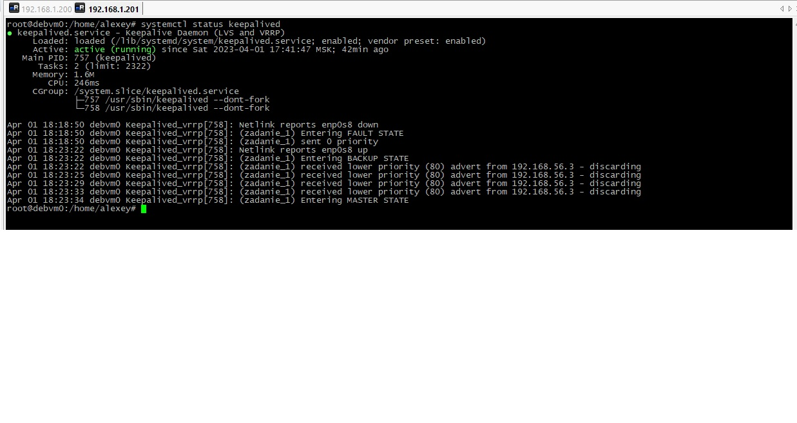
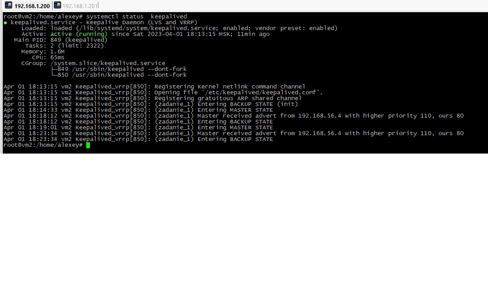
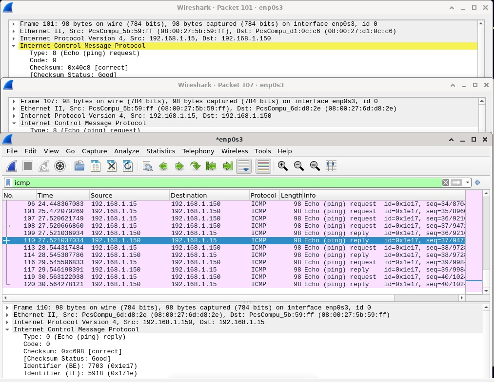

# Домашнее задание к занятию "`10.1 «Keepalived/vrrp»`" - `Дьяконов Алексей`

### Задание 1. Установка  keepalived .

- 1.` Ставим пакет: `

```
    apt install keepalived

```
- 2.` Создаем файл /etc/keepalived/keepalived.conf для первой ноды `

```
    sudo nano /etc/keepalived/keepalived.conf


    vrrp_instance zadanie_1 {  # Указываем VRRP istance (имя экземпляра)

    state MASTER  #Статус - master или BACKUP

    шnterface enp0s8 # Интерфейс VRRP instance

    virtual_router_id 100  # Номер виртуального роутера - от 1 до 255

    priority 110  # Приоритет, где больше тот и мастер

    advert_int 4  # Время между запросами VRRP в секундах

    authentication {

    auth_type AH # Заголовок аутентификации IPsec

    auth_pass Qwerty12 # Der пароль в открытом виде

    }

    unicast_peer {  # Указываются устройства, которые будут видеть запросы

    192.168.56.3

    }
    virtual_ipaddress {

    192.168.1.150 dev enp0s8 label enp0s8:vip # ip -адрес и описание общего виртуального интерфейса
    }
    }

```
   
- 3.` Создаем файл /etc/keepalived/keepalived.conf для второй ноды `

```
    sudo nano /etc/keepalived/keepalived.conf


    vrrp_instance zadanie_1 {

    state BACKUP

    interface enp0s8

    virtual_router_id 100

    priority 80

    advert_int 4

    authentication {

    auth_type AH

    auth_pass Qwerty12

    }

    unicast_peer {

    192.168.56.4

    }
    virtual_ipaddress {

    192.168.1.150 dev enp0s8 label enp0s8:vip
    }
    }

```

- 3.` Запускаем, добавляем в автозагрузку и проверяем статус сервиса `

```
    systemctl start  keepalived
    systemctl enable  keepalived
    systemctl status  keepalived

```
-
-


### Задание 2. Тестирование.

- 1.`Из данного скриншота видно, что при отключении ноды master через несколько пакетов изменяется mac`


-

